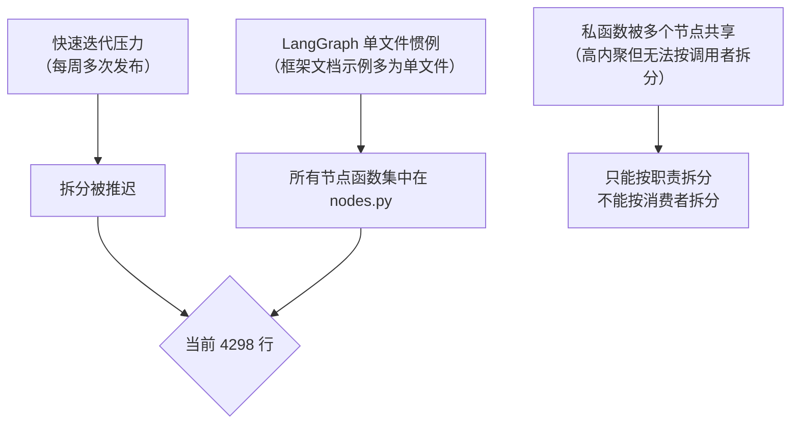

# `nodes.py` 重构实施方案

> **版本**: v1.0 | **创建日期**: 2026-07-25 | **状态**: 草案
>
> **核心原则**: 只做收益足够高的重构。不拆分没坏的东西，不为抽象而抽象。

---

## 1. 现状分析

### 1.1 量化指标

| 指标 | 当前值 | 业内建议 | 偏差 |
|:-----|:------:|:---------|:----:|
| 文件行数 | **4,298** | < 500 | 8.6× |
| 函数数量 | **54** | < 15-20 | 3× |
| 内部 Section 标记 | **43** | — | 反映内部结构复杂 |
| 外部导入文件 | **11** | — | 影响面可控 |
| 函数间交叉引用 | ~80% 私函数被同文件其他函数调用 | — | 高内聚，适合按模块拆分 |

### 1.2 函数分布

| 类别 | 数量 | 占行数 | 代表函数 |
|:-----|:----:|:------:|:---------|
| 公开节点 `node_*` | 26 | ~2000 | `node_scan`, `node_technical`, `node_verdict` |
| 上下文构建 `_build_*` | 8 | ~500 | `_build_fdc_technical_context` |
| 报告生成 `_write_*` | 4 | ~300 | `_write_scan_report`, `_write_verdict_report` |
| HTML 渲染 `_render_*` | 1 | ~50 | `_render_html` |
| 工具函数 | 10 | ~400 | `_repair_json`, `_resolve_alias` |
| 代码-推理边界 | 2 | ~80 | `_compute_stop_target`, `_clamp_position` |
| 辩论协议常量 | 1 | ~80 | `ATTACK_DIMENSIONS` 等 |
| 导入+配置 | — | ~200 | `import`, 全局常量 |

### 1.3 根因



---

## 2. 成本-收益分析

### 2.1 收益（定性 + 定量）

| # | 收益 | 量化估算 | 权重 |
|:-:|:-----|:---------|:----:|
| 1 | **减少合并冲突** — 多人/多任务修改同一文件时冲突概率高 | 按函数粒度拆分后，同时修改不同模块的冲突概率趋近于 0 | ★★★★★ |
| 2 | **提升可导航性** — 当前找函数靠 IDE 搜索，文件长到无法一次滚动浏览全部 | 拆分后每个文件 500-800 行，IDE 大綱可一次展示 | ★★★★ |
| 3 | **降低认知负荷** — 新开发者打开 4298 行文件无从下手 | 按阶段命名（_node_prepare / _node_verdict_risk），意图一目了然 | ★★★★ |
| 4 | **加速测试** — 修改某个阶段只需导入对应模块，减少无关模块的测试影响范围 | 当前 pytest 无差别覆盖全文件 | ★★★ |
| 5 | **防止行数继续膨胀** — 当前 4K+，以目前迭代速度半年后可能 6K+ | 拆分后各模块有自然上限（~800 行），超限时再拆 | ★★★★ |
| 6 | **Harness 对齐** — `02-lifecycle.md` 的阶段划分直接映射到模块命名 | 文档→代码的结构一致性，减少文档偏航 | ★★ |

**综合判断: 净收益为正。** 尤其 #1 和 #5 在持续迭代的项目中是实实在在的痛点。

### 2.2 成本

| # | 成本项 | 预估工时 | 风险 |
|:-:|:-------|:--------:|:-----|
| 1 | 拆分 54 个函数到 6 个模块 | **2-3 小时** | 低 — 函数边界清晰 |
| 2 | 处理交叉引用/循环导入 | **0.5 小时** | 中 — `_build_*` 被多个节点共享 |
| 3 | 更新 11 个外部导入文件 | **0.5 小时** | 低 — 方案 C 保留重导出 |
| 4 | 更新测试文件和 conftest | **0.5 小时** | 低 — 方案 C |
| 5 | 运行全量测试验证 | **0.5 小时** | — |
| 6 | 更新 Harness 文档 | **0.3 小时** | 低 |
| | **合计** | **~5 小时** | |

### 2.3 净收益评估

```
净收益 = ∑收益权重 - 成本工时 / 人天系数

定性：收益是持续性（每次改代码都受益），成本是一次性
定量：5 小时投入，换来未来每次迭代节省 ~10% 的定位/导航/冲突处理时间

结论：★★★★☆ 值得做，但不需要紧急做 — 可在迭代间隙执行
```

---

## 3. 拆分方案

### 3.1 目标结构

```
fdt_langgraph/
├── nodes.py                    ← 保留为薄重导出层 (~50 lines, 只保留 imports)
├── _nodes_prepare.py           ← P0-P2.5: 准备阶段 (scan / freshness_gate / judge_direction / prepare_data)
├── _nodes_research.py          ← P3: 四源并行 (chain / technical / fundamental / sentiment / merge)
├── _nodes_debate.py            ← P4: 六阶段攻防 (bullish_v1 ~ bull_final, 含 _parse_per_symbol_debate)
├── _nodes_verdict.py           ← P5: 裁决+风控+质检 (verdict / risk_check / quality_inspect)
├── _nodes_output.py            ← P6-P6a: 报告+信号 (report / signal_output / _write_* / _render_*)
├── _nodes_utils.py             ← 共享工具 (ATTACK_DIMENSIONS / _repair_json / _resolve_alias / ...)
├── _nodes_boundary.py          ← 代码-推理边界 (_compute_stop_target / _clamp_position)
└── _nodes_context.py           ← 上下文构建 (_build_fdc_technical_context / NewsRouter / ...)
```

### 3.2 模块职责明细

| 目标文件 | 包含函数 | 预估行数 | 备注 |
|:---------|:---------|:--------:|:------|
| `_nodes_prepare.py` | `node_scan`, `node_freshness_gate`, `node_judge_direction`, `node_prepare_data` + 辅助函数 | ~600 | P0→P2.5 |
| `_nodes_research.py` | `node_chain`, `node_technical`, `node_fundamental`, `node_sentiment`, `node_merge_research` + context 构建 | ~800 | P3 四源 |
| `_nodes_debate.py` | `node_bullish_v1` ~ `node_bull_final` (6 个) + `_parse_per_symbol_debate` | ~500 | P4 辩论 |
| `_nodes_verdict.py` | `node_verdict`, `node_risk_check`, `node_quality_inspect`, `node_store_per_symbol_result`, `node_route_next_symbol`, `node_aggregate_results` + **FDC 指标表构建** | ~800 | P5 裁决链 |
| `_nodes_output.py` | `node_report`, `node_signal_output` + `_write_*` / `_render_*` / `_load_template_*` | ~600 | P6-P6a |
| `_nodes_utils.py` | `_truncate_arguments_text`, `_trim_arguments`, 辩论协议常量, `_repair_json`, `_resolve_alias`, `_normalize_per_symbol`, `_ensure_llm_key`, `_resolve_report_dir`, `_inject_memory_rules`, `_import_*` | ~400 | 纯工具 |
| `_nodes_boundary.py` | `_compute_stop_target`, `_clamp_position` + 相关常量 | ~80 | L0 硬约束 |
| `_nodes_context.py` | `_build_fdc_technical_context`, `_build_fdc_fundamental_context`, `_build_market_*_context`, `_build_scan_signal_table`, `_build_debate_context` | ~500 | prompt 上下文 |

### 3.3 重导出策略（方案 C — 零侵入）

`nodes.py` 保留为**薄重导出层**，所有外部导入不中断：

```python
# fdt_langgraph/nodes.py (重构后)
"""LangGraph 辩论节点函数 — 重导出层。

所有函数已按职责拆分至 _nodes_*.py。
外部导入继续通过 nodes.py 访问，无需修改。
"""

# ── 边界函数 ──
from ._nodes_boundary import _compute_stop_target, _clamp_position

# ── 工具函数 ──
from ._nodes_utils import (
    _repair_json, _resolve_alias, _normalize_per_symbol,
    _ensure_llm_key, _inject_memory_rules,  ...)

# ── 上下文构建 ──
from ._nodes_context import (
    _build_fdc_technical_context, _build_fdc_fundamental_context, ...)

# ── 公开节点 ──
from ._nodes_prepare import node_scan, node_freshness_gate, ...
from ._nodes_research import node_chain, node_technical, ...
from ._nodes_debate import node_bullish_v1, node_bearish_v1, ...
from ._nodes_verdict import node_verdict, node_risk_check, ...
from ._nodes_output import node_report, node_signal_output, ...

# ── 辩论协议常量 ──
from ._nodes_utils import ATTACK_DIMENSIONS, EVIDENCE_WEIGHT_FACTORS, ...
```

**优势**: 11 个外部导入文件**无需任何修改**，`from fdt_langgraph.nodes import node_verdict` 照常工作。

---

## 4. 执行计划

### Phase 1: 基础设施（0.5h）

| 步骤 | 内容 | 验证 |
|:-----|:------|:------|
| 1.1 | 创建 8 个 `_nodes_*.py` 文件 | 文件存在 |
| 1.2 | 从 nodes.py copy-paste 函数体到各目标文件 | 无函数遗漏 |
| 1.3 | 添加模块级 import 各文件的依赖 | `import` 无错误 |

### Phase 2: 工具函数剥离（0.5h）

| 步骤 | 内容 | 验证 |
|:-----|:------|:------|
| 2.1 | `_nodes_utils.py`: 搬运 10 个工具函数 + 辩论协议常量 + 常量定义 | `python -c "from fdt_langgraph._nodes_utils import ..."` 无错误 |
| 2.2 | `_nodes_boundary.py`: 搬运 2 个边界函数 + 5 个常量 | 同上 |
| 2.3 | `_nodes_context.py`: 搬运 8 个上下文构建函数 | 同上 |

### Phase 3: 业务节点剥离（1.5h）

| 步骤 | 内容 | 验证 |
|:-----|:------|:------|
| 3.1 | `_nodes_prepare.py`: P0-P2.5 节点 | 每个文件可独立导入 |
| 3.2 | `_nodes_research.py`: P3 四源 | 同上 |
| 3.3 | `_nodes_debate.py`: P4 六阶段 | 同上（注意 `_parse_per_symbol_debate` 依赖） |
| 3.4 | `_nodes_verdict.py`: P5 裁决链（含 `_build_fdc_indicator_table` 内联逻辑） | 需将原来内联的 FDC 指标表构建提取为函数 |
| 3.5 | `_nodes_output.py`: P6-P6a + 报告函数 | 同上 |

### Phase 4: 重导出层（0.5h）

| 步骤 | 内容 | 验证 |
|:-----|:------|:------|
| 4.1 | 将 nodes.py 替换为薄重导出层 | `from fdt_langgraph.nodes import node_verdict` 正常 |
| 4.2 | 运行 11 个外部导入文件的测试 | 全部通过 |
| 4.3 | 运行 `pre_commit_harness_check.py` | 通过 |

### Phase 5: 验证 + 文档（0.5h）

| 步骤 | 内容 | 验证 |
|:-----|:------|:------|
| 5.1 | 全量测试: `pytest tests/fdt_langgraph/ -v` | 原有测试全部通过 |
| 5.2 | 更新 `01-architecture.md` 的模块依赖图 | 新增 8 个 `_nodes_*.py` |
| 5.3 | 更新 `02-lifecycle.md` 的代码映射 | 阶段→模块路径映射 |
| 5.4 | 更新 `06-testing.md` 的测试目录 | 无变化（外部导入不变） |
| 5.5 | 更新 `CODE_WIKI.md` §3.1.4 | nodes.py 拆分说明 |

---

## 5. 风险与应对

| 风险 | 概率 | 影响 | 应对 |
|:-----|:----:|:----:|:------|
| **循环导入** — `_nodes_*.py` 互相引用 | 中 | 高 | 方案：将共享上下文构建统一放到 `_nodes_context.py`，工具函数放 `_nodes_utils.py`，不交叉引用业务模块 |
| **函数遗漏** — 搬运中遗漏某个函数 | 低 | 高 | 方案：搬运后 diff nodes.py 检查所有函数是否被移除（剩余应仅为 import 语句），配合 grep 函数名确认 |
| **重导出名字冲突** — 同名函数不同语义 | 低 | 中 | 方案：每个函数名唯一，无冲突风险 |
| **测试未覆盖的函数被改坏** | 中 | 中 | 方案：Keep 原始 nodes.py 不做任何逻辑修改，仅 copy-paste |

### 5.1 循环导入防护图

```
_nodes_utils.py (零依赖)
    ↑
_nodes_boundary.py (零依赖)
    ↑
_nodes_context.py (依赖 _nodes_utils)
    ↑
_nodes_prepare.py (依赖 _nodes_utils, _nodes_context)
_nodes_research.py (依赖 _nodes_utils, _nodes_context)
_nodes_debate.py (依赖 _nodes_utils, _nodes_context)
_nodes_verdict.py (依赖 _nodes_utils, _nodes_context, _nodes_debate)
_nodes_output.py (依赖 _nodes_utils, _nodes_context)
    ↑
nodes.py (重导出层 — 依赖全部 8 个模块)
```

**规则**: 依赖方向严格单向，`_nodes_utils` / `_nodes_boundary` 在最底层，不依赖任何业务模块。

---

## 6. 成功标准

| # | 标准 | 验证方式 |
|:-:|:-----|:---------|
| 1 | `pytest tests/fdt_langgraph/ -v` 全部通过 | 测试结果 |
| 2 | `from fdt_langgraph.nodes import node_verdict` 正常工作 | import 验证 |
| 3 | 8 个 `_nodes_*.py` 文件各自 < 800 行 | `wc -l` |
| 4 | `nodes.py` < 80 行（仅 import 语句） | `wc -l` |
| 5 | 所有 11 个外部导入文件无需修改 | `git diff --stat` |
| 6 | `pre_commit_harness_check.py` 全部通过 | hook 结果 |

---

## 7. 不拆分清单

以下文件**不纳入本次重构**（收益不足以覆盖成本）：

| 文件 | 行数 | 不拆理由 |
|:-----|:----:|:---------|
| `test_scripts.py` | 3,702 | 测试文件行数容忍度高；自动化运行无感知；拆分破坏测试定位习惯 |
| `scan_all.py` | 1,633 | 功能内聚（全量扫描管线）；拆分引入的 import 管理成本超过收益 |
| `run_debate.py` | 1,477 | 功能内聚（辩论执行管线）；即将改为异步重构，等异步化后再决定 |
| `phase3_generate_report.py` | 1,844 | 功能内聚（报告生成管线）；"大但稳定" — 改动频率远低于 nodes.py |

> **决策原则**: 如果某个文件虽然大但**改动频率低**（一个月不超过 2 次），结构又清晰，就不拆。

---

## 8. 附录: 当前函数完整清单

| 行号 | 函数名 | 类别 | 目标模块 |
|:----:|:-------|:----:|:---------|
| 30 | `_truncate_arguments_text` | 工具 | `_nodes_utils` |
| 41 | `_compute_stop_target` | 边界 | `_nodes_boundary` |
| 78 | `_clamp_position` | 边界 | `_nodes_boundary` |
| 99 | `_trim_arguments` | 工具 | `_nodes_utils` |
| 120 | `ATTACK_DIMENSIONS` | 常量 | `_nodes_utils` |
| 141 | `_ensure_llm_key` | 工具 | `_nodes_utils` |
| 148 | `_repair_json` | 工具 | `_nodes_utils` |
| 217 | `_resolve_alias` | 工具 | `_nodes_utils` |
| 225 | `_normalize_per_symbol` | 工具 | `_nodes_utils` |
| 248 | `_resolve_report_dir` | 工具 | `_nodes_utils` |
| 279 | `_load_template_css` | 报告 | `_nodes_output` |
| 288 | `_load_template_html` | 报告 | `_nodes_output` |
| 301 | `_render_html` | 报告 | `_nodes_output` |
| 333 | `_write_scan_report` | 报告 | `_nodes_output` |
| 380 | `_write_verdict_report` | 报告 | `_nodes_output` |
| 448 | `_write_research_report` | 报告 | `_nodes_output` |
| 523 | `_write_signal_report` | 报告 | `_nodes_output` |
| 589 | `_import_from_skill` | 工具 | `_nodes_utils` |
| 606 | `_import_skill_module` | 工具 | `_nodes_utils` |
| 628 | `node_scan` | 公开节点 | `_nodes_prepare` |
| 707 | `node_freshness_gate` | 公开节点 | `_nodes_prepare` |
| 794 | `node_judge_direction` | 公开节点 | `_nodes_prepare` |
| 876 | `node_prepare_data` | 公开节点 | `_nodes_prepare` |
| 1181 | `node_chain` | 公开节点 | `_nodes_research` |
| 1243 | `_inject_memory_rules` | 工具 | `_nodes_utils` |
| 1277 | `_build_scan_signal_table` | 上下文 | `_nodes_context` |
| 1303 | `_build_fdc_technical_context` | 上下文 | `_nodes_context` |
| 1308 | `_build_market_technical_context` | 上下文 | `_nodes_context` |
| 1460 | `_build_fdc_fundamental_context` | 上下文 | `_nodes_context` |
| 1465 | `_build_market_fundamental_context` | 上下文 | `_nodes_context` |
| 1570 | `node_technical` | 公开节点 | `_nodes_research` |
| 1866 | `node_fundamental` | 公开节点 | `_nodes_research` |
| 2100 | `node_sentiment` | 公开节点 | `_nodes_research` |
| 2197 | `node_merge_research` | 公开节点 | `_nodes_research` |
| 2204 | `node_bullish_v1` | 公开节点 | `_nodes_debate` |
| 2278 | `node_bearish_v1` | 公开节点 | `_nodes_debate` |
| 2357 | `node_bearish_rebuttal` | 公开节点 | `_nodes_debate` |
| 2425 | `node_bullish_rebuttal` | 公开节点 | `_nodes_debate` |
| 2500 | `_parse_per_symbol_debate` | 工具 | `_nodes_debate` |
| 2578 | `node_bear_final` | 公开节点 | `_nodes_debate` |
| 2700 | `node_bull_final` | 公开节点 | `_nodes_debate` |
| 2840 | `node_verdict` | 公开节点 | `_nodes_verdict` |
| 3224 | `node_risk_check` | 公开节点 | `_nodes_verdict` |
| 3423 | `node_quality_inspect` | 公开节点 | `_nodes_verdict` |
| 3546 | `node_store_per_symbol_result` | 公开节点 | `_nodes_verdict` |
| 3632 | `node_route_next_symbol` | 公开节点 | `_nodes_verdict` |
| 3662 | `node_aggregate_results` | 公开节点 | `_nodes_verdict` |
| 3711 | `node_report` | 公开节点 | `_nodes_output` |
| 4036 | `node_signal_output` | 公开节点 | `_nodes_output` |
| 4076 | `_build_debate_context` | 上下文 | `_nodes_context` |
| 4124 | `_load_cache` | 公开节点 | `_nodes_prepare` |
| 4175 | `_update_cache` | 公开节点 | `_nodes_prepare` |
| 4205 | `_build_trade_params_context` | 上下文 | `_nodes_context` |
| 4251 | `_build_per_symbol_quality_section` | 上下文 | `_nodes_context` |
